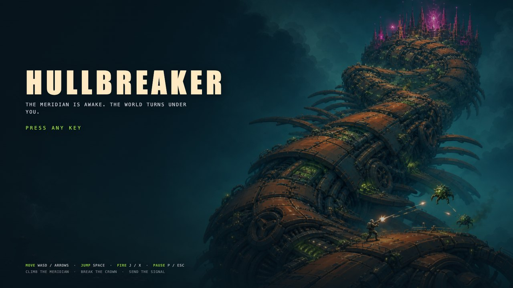
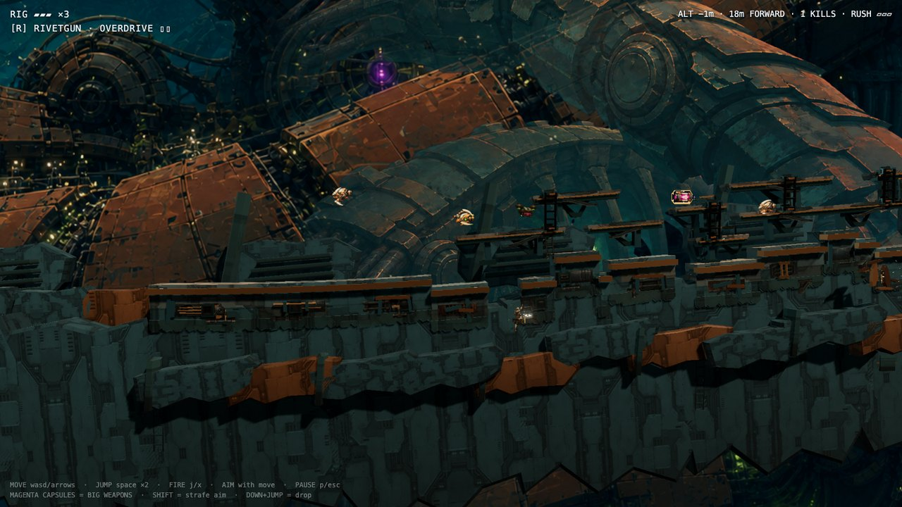
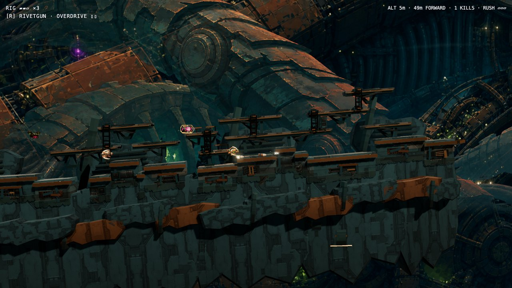

# HULLBREAKER



**A Contra-style 2.5D run-and-gun that runs in your browser.** The Meridian —
a terraforming ship the size of a weather system — has woken up feral, and
you are **RIG**, the salvage marine already on its hull. Fight up the
outside of its tower one wave at a time, break the Crown at the summit, and
send the signal home.

## ▶ [Play it now](https://aetherwing-io.github.io/hullbreaker/)

Free, no install, nothing to download — keyboard required. If it ever fails
to start, the game tells you so in plain language instead of going black.



## The run

- **Six faces, one tower.** The level is the exterior of a hexagonal tower:
  six faces, each a combat wave riding a forced scroll. Clear the wave at a
  corner and the world ratchets 60° around the edge while the next face
  assembles itself out of the dark.
- **Contra-rules arsenal.** **R** rifle, **S** spread, **L** piercing laser,
  **H** homing swarm, **F** flame wave. Carrier drones haul the letter
  capsules; take a hit and your capsule pops out for a ~2-second recatch
  window, classic style.
- **A machine ecology.** Wasps cruise and dive, houndframes charge and own
  the floor, iris polyps bracket the catwalks, spore mortars deny your
  landing zones — each taught on its own stage, then combined against you.
- **Stackable storm mods** from late carriers: RAGE (double fire rate),
  GHOST SQUAD (two echoes replay your shots on a delay), ORBITAL LANCE (a
  telegraphed screen clear), CHRONO (the world at 0.35×, you at full speed).
- **A finale, not just a last wave.** At the summit the Crown arms a
  battered array: hold the signal while everything the ship has left comes
  at you.



## Controls

| Input | Action |
| --- | --- |
| WASD / arrows | Move + 8-way aim |
| Space (or K) | Jump — hold for height, press again in air for double jump |
| J (or X) | Fire (hold for auto) |
| Shift | Strafe-lock (freeze aim while moving) |
| C | Swap between the field rifle and your carried capsule weapon |
| Down + Jump | Drop through catwalks |
| P / Esc | Pause (carries the options panel) |
| R | Restart (while paused, or on death/victory) |
| Q | Back to the start screen (from pause, death or victory) |
| H | Hide/show the HUD (start screen or pause) |
| 1 / 2 / 3 | Start screen only: swap the title composition |

Movement is the forgiving kind: coyote time, jump buffering, variable jump
height, and i-frames on hit. Three lives.

## Run it locally

```sh
git clone https://github.com/aetherwing-io/hullbreaker.git
cd hullbreaker
node tools/serve.mjs   # → http://127.0.0.1:8741/index.html
```

No build step, no `npm install` — plain HTML, ES modules, and three.js from
a CDN (first load needs internet). Any static file server works, but prefer
`tools/serve.mjs`: it sends `no-store` on everything, and a generic server's
heuristic caching can hand Chrome a stale module from an earlier session and
blank the whole page. (The war story is in `docs/ENGINEERING.md`.)

## Hacking on it

The game is four layers of dependency-free ES modules, each importing only
downward:

| Layer | Contents |
| --- | --- |
| `src/config.js` | `CONFIG` — every tuning constant, plus the weapon roster |
| `src/pure/` | deterministic math and data; no imports outside this layer |
| `src/sim/` | the simulation — no THREE, no `document`, no `window`; it steps in Node |
| `src/render/` + `src/ui/` | the view: three.js scene, sprites, VFX, HUD, audio |

The sim reaches the view only through named hooks (`src/sim/bridge.js`), so
game logic is testable without a browser. `src/boot/` owns view init and
run-reset order; `src/render/hostile-presenters/` owns how each enemy kind
is drawn (sprite, primitive, or ecology composite); `src/render/
adaptive-fidelity.js` sheds effects load before it drops frames.

### The gates

```sh
node tools/pathcheck.mjs               # the assertion suite (3,800+); keep it green
node tools/deploy/verify-bundle.mjs    # boots the real deploy bundle in Chrome
```

Browser smoke test: open `index.html?selftest=1`. There is also a
Playwright bot-player harness (`tools/playtest/`) and a headless sim lab
(`tools/simlab/`) — each has its own README. The harness's `--deterministic`
mode installs input before boot, applies it on exact simulation ticks, and
freezes on an exact terminal tick for repeatable tuning comparisons.

Useful URL flags while developing: `?view=near|mid|far` (camera) ·
`?slice=traversal` (movement playground; `&polyp=1` / `&mortar=1` teach
stages) · `?juice=0` (pre-juice, simulation-identical build) · `?audio=0` ·
`?zip=1` (legacy corner reveal) · `?momentum=1` (earned pace escalation).

### Read these first

New working sessions start with [`docs/HANDOFF.md`](docs/HANDOFF.md). The
target game is [`docs/DESIGN.md`](docs/DESIGN.md); canon and open lore live
in [`docs/STORY.md`](docs/STORY.md); [`docs/decisions.md`](docs/decisions.md)
records operator verdicts, which are law. The full engineering tour that
used to occupy this README is [`docs/ENGINEERING.md`](docs/ENGINEERING.md),
and shipping (itch.io zip / GitHub Pages branch) is
[`tools/deploy/README.md`](tools/deploy/README.md).
