# HULLBREAKER concept-art reference pack

These images are aspirational visual references for the target experience in
[`docs/DESIGN.md`](../DESIGN.md) and its [`story spine`](../STORY.md). They are
intended to give designers, implementers, and future agents a shared picture of
the finished game's spatial language, palette, camera, and escalation.

They are **not** exact level blueprints or final asset designs. Preserve the
principles below; do not blindly reproduce incidental platform positions,
enemy anatomy, door engineering, or surface decoration.

## Current art-direction ruling

Operator feedback on July 29 rejected the rectilinear, warehouse-heavy macro
environment in much of images 1–5 and 8. Their palette, enemy readability,
route logic, and transformation intent remain useful, but they should not define
the Meridian's large-scale form.

The corrected hierarchy is:

- **macro:** one continent-sized floating robotic creature-ship;
- **meso:** carapace scutes, ribs, gills, vertebrae, joints, limbs, and tendon
  machinery form the traversal topology;
- **local:** functional colony-ship infrastructure supplies seams, mechanisms,
  inhabited scale, and readable play surfaces; and
- **Crown:** a real bridge, command, terraforming, defense, and transmitter
  complex—not a separate creature, head, brain, or literal heart.

The traversal lattice must feel grown from the creature-ship's engineered
anatomy, not like scaffolding attached to a warehouse. Images 9–11 and 13 are
the leading environment-form and camera references. Image 6 remains the leading
enemy-form and color reference.

The CP3 render ruling further constrains those references: during ordinary
turns and transitions the body anatomy already exists and remains static. RIG
and the camera reveal the next face. Only doors, neck access plates, vent
covers, shutters, traps, enemies, and functional Crown mechanisms may move;
live damage may destroy or expose existing routes. Literal scute/rib assembly
shown in images 10–13 is superseded by this rule.

## Reference images

### 1. Finished exterior gameplay

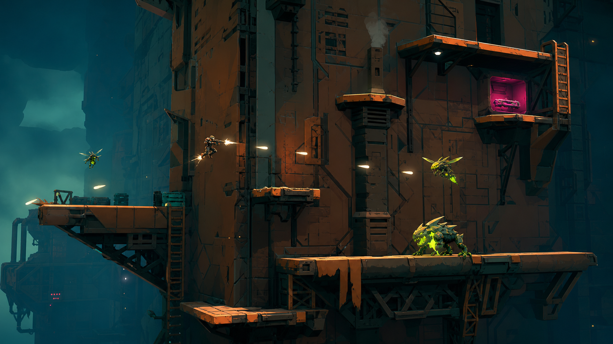

Shows the target moment-to-moment presentation:

- side-on 2D combat readable inside a fully 3D world;
- small, agile RIG launching between connected routes while firing;
- multiple elevations, vertical surfaces, an overhang, and a visible reward
  pocket instead of rows of disconnected platforms;
- enemies occupying different spatial roles; and
- the deep-teal, rust-orange, acid-green, hot-magenta, and warm-white palette.

### 2. Bulkhead flip

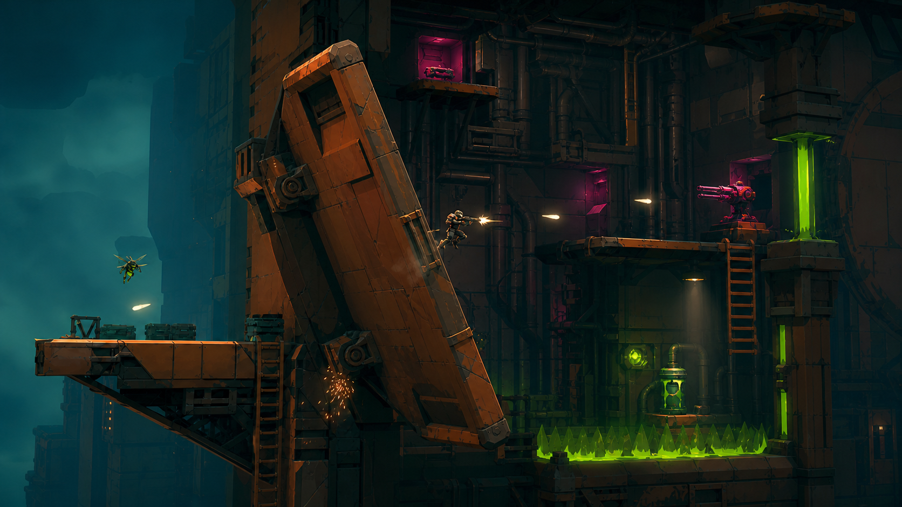

Shows the exterior-to-interior transition:

- a massive physical door rotates inward on chunky machinery;
- RIG keeps control and continues firing during the transformation;
- the same 2D combat plane commits to a different rendered surface; and
- the interior introduces shafts, compressed routes, machinery, turrets, and
  hazards while visibly gaining altitude.

### 3. Traversal-lattice layout

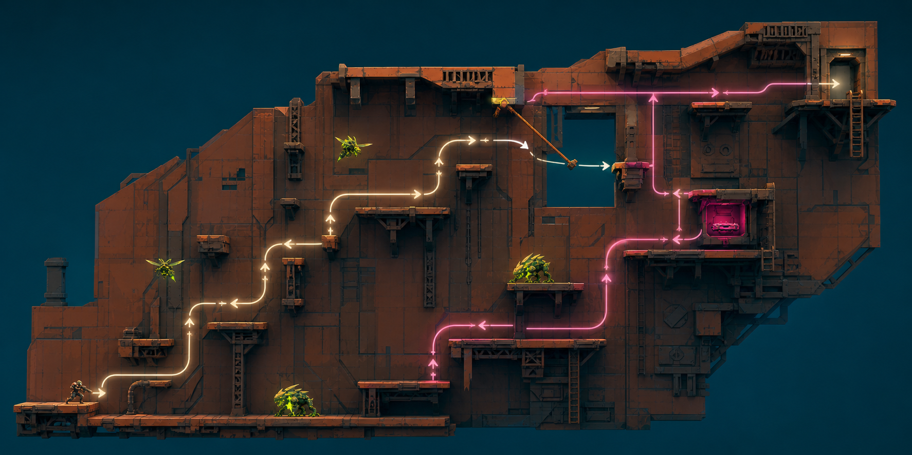

Shows the intended level-design grammar rather than a literal shipped stage:

- two primary routes braid, split, and reconnect;
- local choices remain readable even though the whole phase spans many
  elevations;
- a wall-jump ascent, ledge transfers, hook launch, upper shortcut, and lower
  pressure route serve different movement strengths;
- enemies occupy route-specific threat positions; and
- the magenta dare pocket has an identifiable reward, commitment, and retreat
  path under scrolling pressure.

The glowing route traces are explanatory overlays, not proposed in-game UI.

### 4. Six-phase escalation

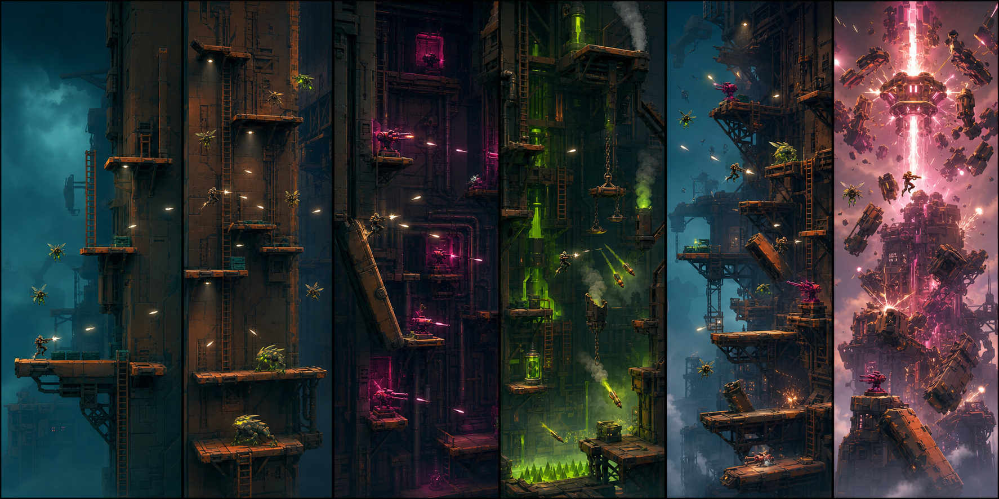

Shows the target dramatic ramp from left to right:

1. restrained lower exterior and basic wasp pressure;
2. denser wall-jump scaffolds and ground chargers;
3. compressed interior crossfire;
4. machinery, landing denial, and more vertical traversal;
5. a high exterior kill lattice with mixed threats; and
6. the HULLBREAKER summit, where doors, interlocks, traps, and damage reshape
   route access during peak-power combat without assembling the body.

### 5. Start-screen directions

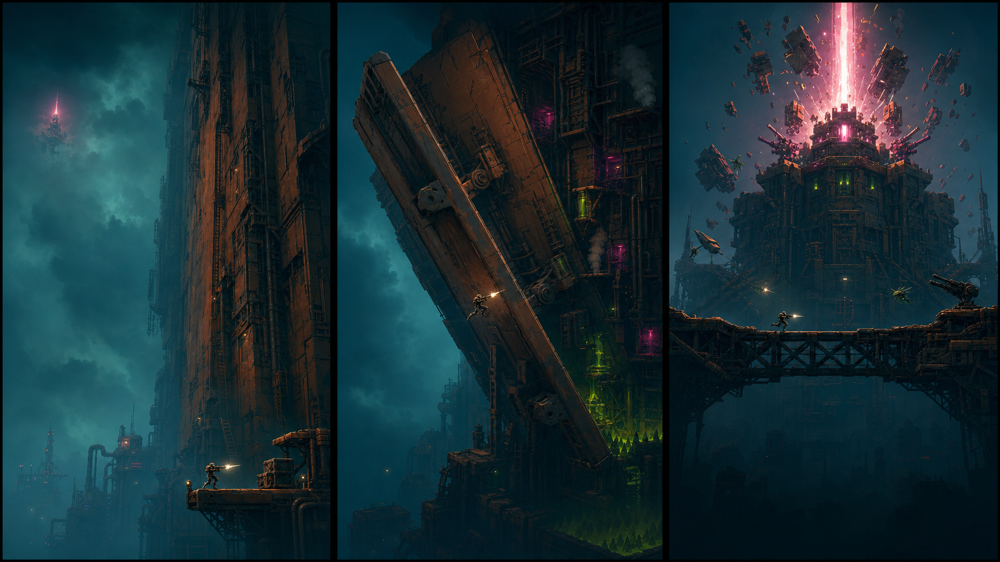

Tests three brand promises from left to right:

1. **The Impossible Climb** centers human scale, altitude, and the settlement;
2. **The Ship Wakes** makes transforming architecture the signature hook; and
3. **Scuttle the Crown** promises the maximal summit spectacle.

These are composition studies with deliberate title/menu space, not finished UI
or logo treatments. The middle direction is the most game-specific; the left is
the clearest story pitch; the right is the strongest action-poster pitch.

### 6. Enemy form language

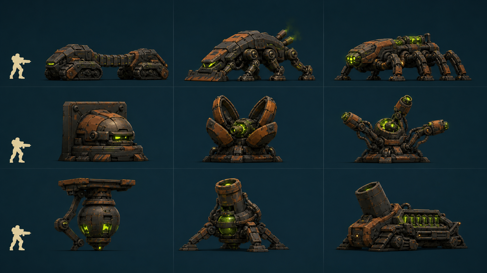

Compares three enemy families by row:

- Houndframe ground chargers;
- rooted polyp connector turrets; and
- spore mortars for delayed landing denial.

Each row moves left to right from repurposed maintenance hardware, through the
recommended bio-industrial balance, to more uncanny terraforming machinery. The
center column currently gives the strongest shared family: **Brace Hound**,
**Iris Polyp**, and **Seed-Pod Tripod**. This board explores form language; it
does not lock final models.

### 7. Enemy combat readability

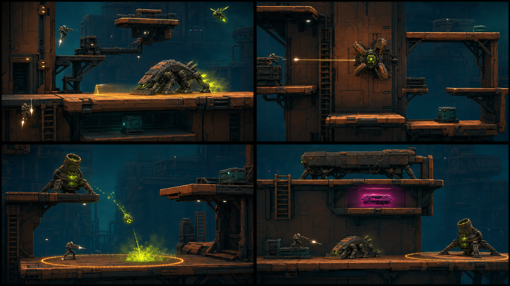

Places the recommended enemy forms into four side-on play situations:

- a Brace Hound announcing a committed floor charge;
- an Iris Polyp locking one connector while alternatives remain visible;
- a Seed-Pod Tripod marking the intended landing surface; and
- a non-aggressive carrier luring RIG into a recoverable dare pocket.

The hound mass and mortar denial read strongly. The polyp likely needs a more
side-facing barrel in a model pass, and the carrier should retain its broad,
non-predatory silhouette.

### 8. Transformation sequences

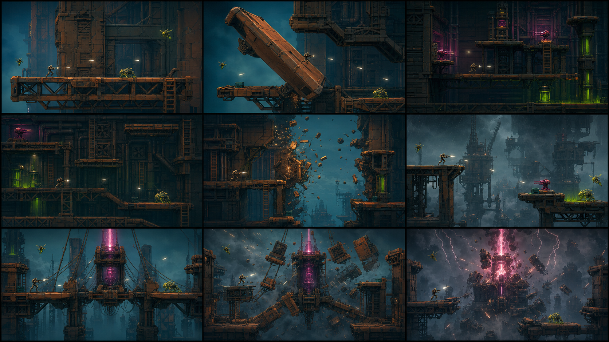

Uses locked before/during/after views to test spatial—not merely cosmetic—
change:

- exterior bulkhead flip into interior containment;
- upper-interior breach back to a higher exterior; and
- Crown lockdown, structural rejection, and scuttle.

The diagnostic standard is that RIG stays controllable, permitted moving
mechanisms remain playable, and the committed playfield presents a new route
problem. The panels are sequence targets, not frame-accurate engineering plans.
Their literal moving-wall imagery is not current transition canon: body anatomy
stays static, while only doors, covers, shutters, and Crown mechanisms may move.

### 9. Meridian creature directions

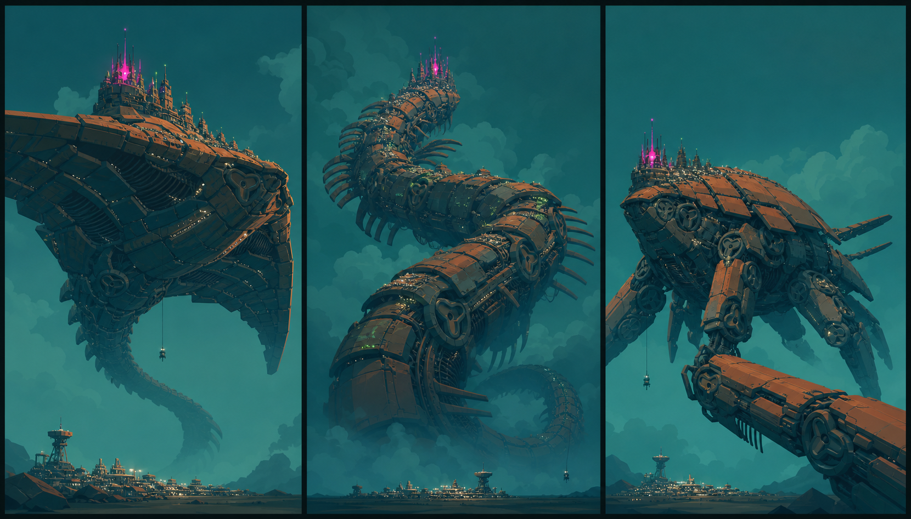

Tests three macro body plans from left to right:

1. **Crownback Sky-Ray:** broad plates, gill cavities, and underside-to-dorsal
   transitions;
2. **Meridian Spine-Serpent:** vertebral districts, vertical coils, and discrete
   camera ratchets around static segments; and
3. **Six-Limbed Ark-Beast:** limb transfers, joint sockets, and an armored
   colony shell.

The current synthesis uses the Spine-Serpent's climbable ascent structure with
the Sky-Ray's broad scutes and gill cavities. All three deliberately preserve a
functional Crown and inhabited colony-ship scale.

### 10. Creature-lattice chaos

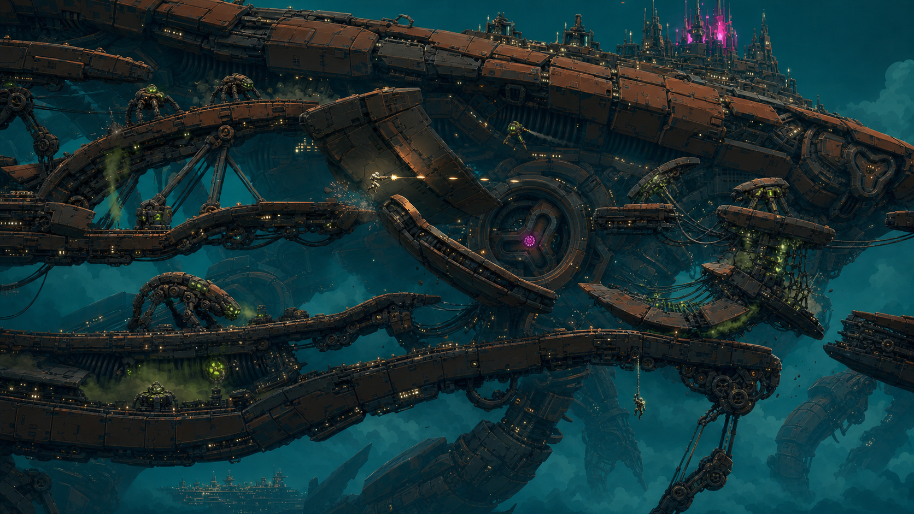

Shows the corrected moment-to-moment fantasy:

- the traversal lattice is the body—scutes, ribs, tendon transfers, gimbals,
  and opened cavities;
- the distant spine, limbs, Crown, and settlement keep macro scale visible;
- one access plate and one vent cover may move while nearby anatomy stays
  prebuilt and static; and
- geometry changes, enemies, fire, and debris layer into readable chaos.

This is an intensity target, not a requirement to activate every system in
every encounter. Use its route density and silhouette hierarchy, not its literal
body articulation.

### 11. Creature flip and breach sequences

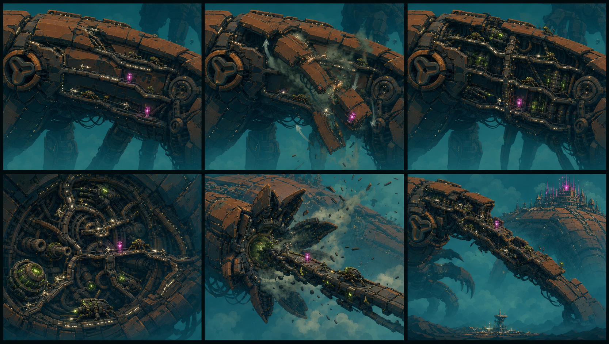

The top row visualizes an exterior-to-interior **neck access-plate flip**. The
bottom row visualizes a **dorsal vent breach** onto a much higher spinal ridge.
Its rolling scutes and telescoping lattice are superseded: only the access plate
or vent cover may move, while the next route and surrounding ribs already exist.

Repeated scutes, capsules, and edge lights make orientation traceable through
the reveal. The access plate or vent cover should feel like a procedural defense
response while preserving control and route readability.

### 12. Kaiju-ship level anthology

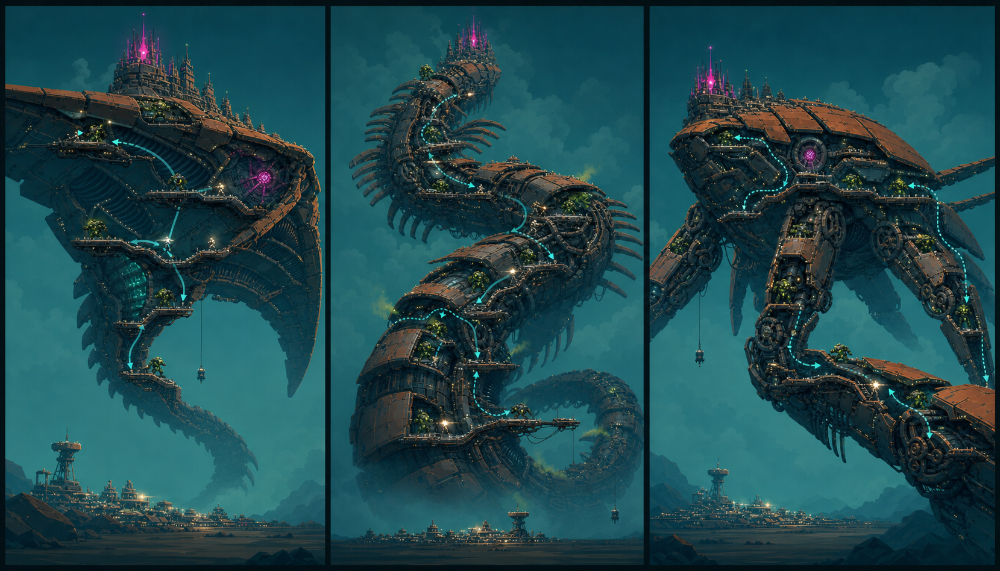

Explores—but does not canonize—the three creature silhouettes as three complete
levels:

- Sky-Ray: wind, gills, plate flips, and underside-to-dorsal movement;
- Spine-Serpent: camera ratchets around vertebral facets, coils, and altitude;
- Ark-Beast: limb-to-shell transfers and joint-driven set pieces.

The operator rejected this as a moment-to-moment camera reference: it pulls too
far out, makes RIG microscopic, and turns the climb into an infographic. The
cyan traces are explanatory only and are not proposed HUD. Keep the board only
as a macro comparison of possible world-bodies or level identities. The
existing single-Meridian story remains canon until the operator chooses
otherwise.

### 13. Human-scale monster-climb grammar

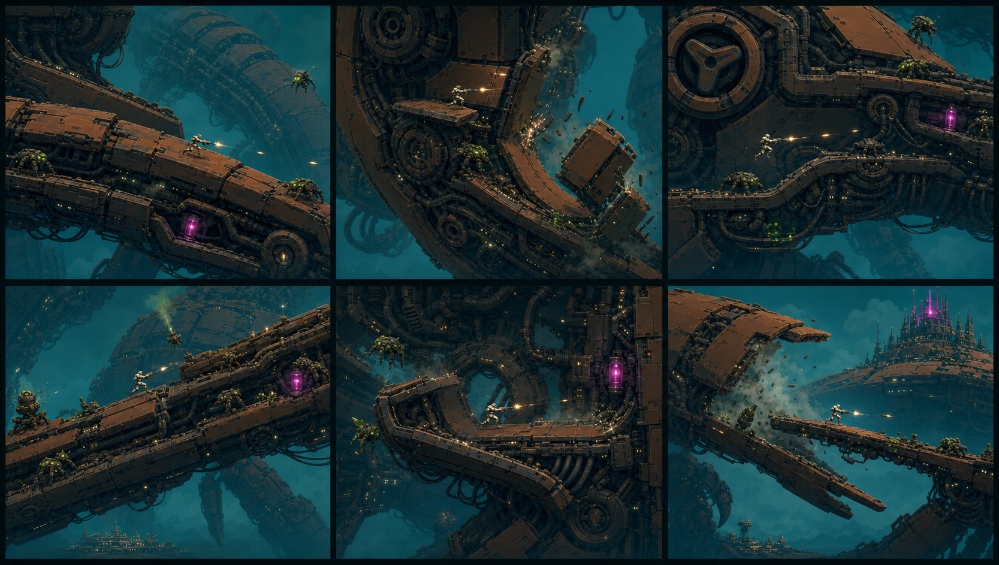

Corrects the camera relationship:

- ordinary play shows a human-scale RIG on one building-sized patch of the
  creature's machinery;
- the whole monster is inferred through curvature, far static limbs, fog,
  camera orbit, and the next transition—not framed like a map;
- the shipped 60-degree ritual becomes a camera turn around a static faceted
  leg or body ring;
- a long phase can run up one ribline;
- one door-like neck access plate can flip inward while carrying the player;
  and
- an upper vent cover can open onto an already-existing exterior far higher.

The corresponding implementable six-phase layout, screen windows, gate
fixtures, and test questions live in the
[`Meridian monster greybox map proposal`](../proposals/2026-07-meridian-monster-greybox-map.md).

### 14. Vertical assault level

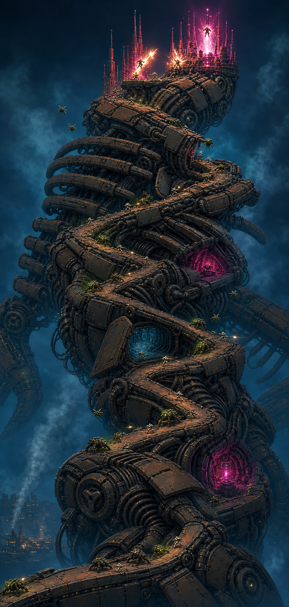

Fuses board 04's cumulative phase pressure with the corrected creature anatomy
and altitude model as one borderless ankle-to-Crown level. This is a stitched
macro sequencing reference for greybox planning, not the ordinary gameplay
camera: each local screen should still preserve board 13's human-scale RIG
relationship.

The layout makes a firmer ruling than the earlier escalation boards:

- altitude is earned continuously on the traversal stretches themselves;
- gates are compact switchback turns around static facets and grant **zero**
  altitude;
- the main route keeps climbing right/up, left/up, and back/right/up through
  leg, haunch, ribline, neck, pressure tract, vent, collar, and Crown;
- two-to-four short route braids may create local choices, but they reconnect
  quickly instead of becoming long screen-wide strips;
- only the neck access plate and vent cover may move before the Crown; the
  surrounding anatomy and every route-bearing body surface already exist; and
- the Crown resolves the climb with a legible launch → kill → relaunch cadence,
  using live damage and functional interlocks rather than assembling anatomy.

The portrait framing is intentionally diagnostic: if a future greybox cannot
be traced upward without arrows, or if a gate appears to award height by
camera snap, it has drifted from this direction.

## Visual invariants

Future concepts and implementation should preserve:

- a side-on gameplay camera with slight 3D perspective depth;
- RIG at roughly seven percent of the screen height;
- strong silhouettes and flat-shaded, chunky industrial geometry;
- three-to-five immediately readable routes even when a phase contains more;
- surfaces that belong to a connected hull rather than arbitrary floating
  platforms;
- a creature-ship macro silhouette visible often enough that local machinery
  never collapses into a warehouse or refinery;
- route geometry derived from armored anatomy—scutes, ribs, gills, vertebrae,
  joints, limbs, and tendon mechanisms—before generic catwalks or scaffolding;
- static monumental anatomy during turns, revealed by RIG/camera motion rather
  than body assembly;
- color roles: deep teal atmosphere, rust-orange structure, acid-green danger,
  hot-magenta power/reward, and warm-white player fire;
- visible altitude gain across phases; and
- rising spectacle without sacrificing threat, route, or character readability.

## Deliberately unresolved

These images do not lock:

- final character or enemy models;
- exact platform, hook, trap, or pickup locations;
- whether ladders survive into the movement grammar;
- the exact number of routes visible in any encounter;
- final door, hinge, or tower construction;
- HUD composition;
- final lighting, texture density, or post-processing; or
- the implementation sequence described in the design document.

Generation used OpenAI's built-in image-generation tool. The prompt set is
preserved in [`PROMPTS.md`](PROMPTS.md).
